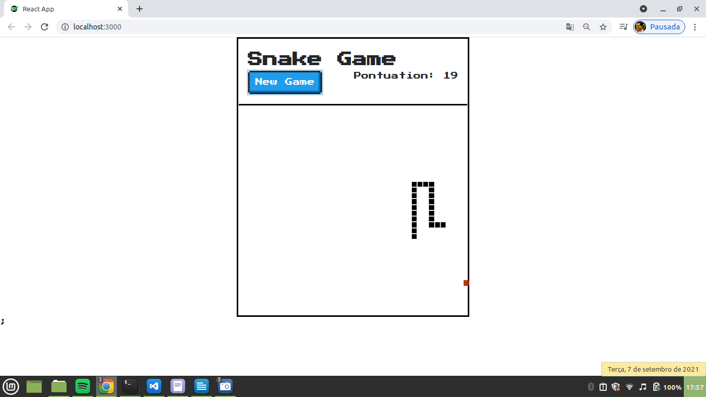
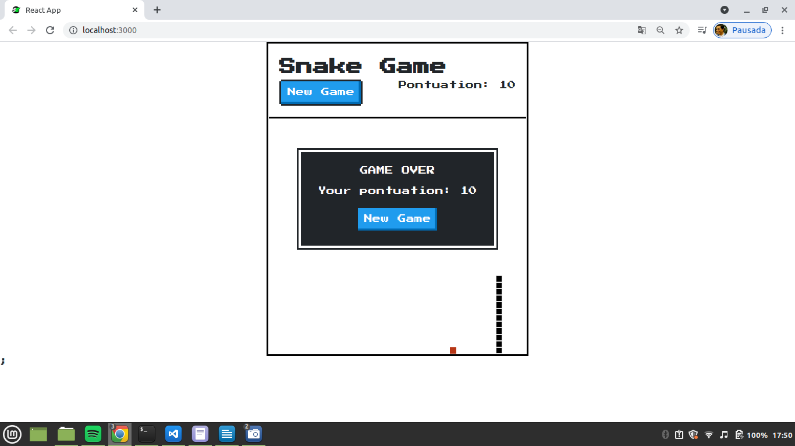

<h1 align="center">:snake: Snake Game :video_game:</h1>
<p align="center">Snake game built with Reactjs and using ContextAPI to share states</p>
<p align="center"><a href="https://rogeriomattos.github.io/snake-game-react-js/" target="_blank">Test the game by clicking here!</a></p>
<p align="center">
  <a href="#installation">Installation</a> •
</p>

<p align="center">

   

  
</p>

### Installation


First download the repository to your computer, as shown below:
```bash
  git clone https://github.com/rogeriomattos/snake-game-react-js/
```

Then, go into the ``snake-game-react-js`` folder and install the project's dependencies, as shown below:
```bash
  cd snake-game-react-js
  npm istall
```

Finally, to run the game just run the following command:
```bash
  npm start
